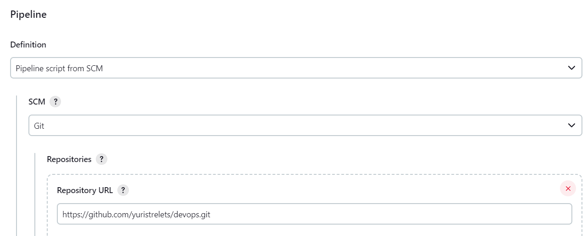
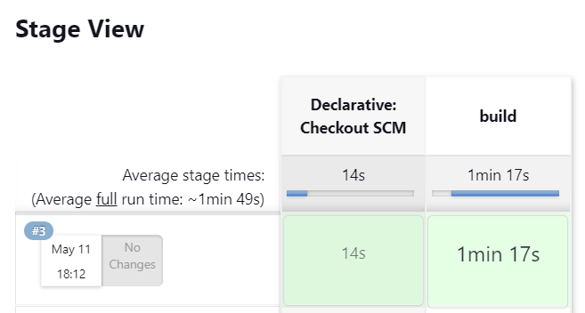

Створив у Jenkins новий pipeline, який зтягує git-репозиторій:



Додав у корінь цього репозиторію [Jenkinsfile](../Jenkinsfile), 
який змінює робочу директорію та запускає `docker build`.

Результат запуску pipeline'у:



Console output:

```text
Started by user styv
Obtained Jenkinsfile from git https://github.com/yuristrelets/devops.git
[Pipeline] Start of Pipeline
[Pipeline] node
Running on Jenkins in /var/jenkins_home/workspace/git
[Pipeline] {
[Pipeline] stage
[Pipeline] { (Declarative: Checkout SCM)
[Pipeline] checkout
Selected Git installation does not exist. Using Default
The recommended git tool is: NONE
No credentials specified
Cloning the remote Git repository
Cloning repository https://github.com/yuristrelets/devops.git
 > git init /var/jenkins_home/workspace/git # timeout=10
Fetching upstream changes from https://github.com/yuristrelets/devops.git
 > git --version # timeout=10
 > git --version # 'git version 2.30.2'
 > git fetch --tags --force --progress -- https://github.com/yuristrelets/devops.git +refs/heads/*:refs/remotes/origin/* # timeout=10
 > git config remote.origin.url https://github.com/yuristrelets/devops.git # timeout=10
 > git config --add remote.origin.fetch +refs/heads/*:refs/remotes/origin/* # timeout=10
Avoid second fetch
 > git rev-parse refs/remotes/origin/master^{commit} # timeout=10
Checking out Revision 37dd43528baa7886a2b91e39f7d0dfab302fa254 (refs/remotes/origin/master)
 > git config core.sparsecheckout # timeout=10
 > git checkout -f 37dd43528baa7886a2b91e39f7d0dfab302fa254 # timeout=10
Commit message: "add Jenkinsfile"
First time build. Skipping changelog.
[Pipeline] }
[Pipeline] // stage
[Pipeline] withEnv
[Pipeline] {
[Pipeline] stage
[Pipeline] { (build)
[Pipeline] dir
Running in /var/jenkins_home/workspace/git/lab1
[Pipeline] {
[Pipeline] sh
+ docker build -t my-image-name .
#1 [internal] load build definition from Dockerfile
#1 sha256:c81e3e7154b2ba6db0989e8cc605d27b95f50ee35d0df30dbb3ee221cd05783e
#1 transferring dockerfile: 249B 0.0s done
#1 DONE 0.1s

#2 [internal] load .dockerignore
#2 sha256:5703568f532a67f5580c11b5a07719a0445693b3edf50a091bb597a708709d2a
#2 transferring context:
#2 transferring context: 2B 0.0s done
#2 DONE 0.1s

#3 [internal] load metadata for docker.io/library/alpine:3.17
#3 sha256:02b6038a7d6a3f8496654c3122b4ec72f736b06485adb00f5add321d8d6644aa
#3 DONE 3.5s

#7 [internal] load build context
#7 sha256:d2fef7b94500c2ccd40273199f796b0e430f42edda43e5d0ec5ca50aa52a70da
#7 transferring context: 262B 0.0s done
#7 DONE 0.1s

#4 [1/6] FROM docker.io/library/alpine:3.17@sha256:124c7d2707904eea7431fffe91522a01e5a861a624ee31d03372cc1d138a3126
#4 sha256:42909a26917df41199aea555921cbce1f768cf03cbf4e1f29374960450546818
#4 resolve docker.io/library/alpine:3.17@sha256:124c7d2707904eea7431fffe91522a01e5a861a624ee31d03372cc1d138a3126 0.0s done
#4 sha256:124c7d2707904eea7431fffe91522a01e5a861a624ee31d03372cc1d138a3126 1.64kB / 1.64kB done
#4 sha256:b6ca290b6b4cdcca5b3db3ffa338ee0285c11744b4a6abaa9627746ee3291d8d 528B / 528B done
#4 sha256:9ed4aefc74f6792b5a804d1d146fe4b4a2299147b0f50eaf2b08435d7b38c27e 1.47kB / 1.47kB done
#4 DONE 0.1s

#5 [2/6] RUN apk add --no-cache curl
#5 sha256:fe45f740b22333780c2d2899e1033a1f7352b1e7786b67956fb19d218e508ef7
#5 0.298 fetch https://dl-cdn.alpinelinux.org/alpine/v3.17/main/x86_64/APKINDEX.tar.gz
#5 4.103 fetch https://dl-cdn.alpinelinux.org/alpine/v3.17/community/x86_64/APKINDEX.tar.gz
#5 45.76 (1/5) Installing ca-certificates (20230506-r0)
#5 50.50 (2/5) Installing brotli-libs (1.0.9-r9)
#5 57.52 (3/5) Installing nghttp2-libs (1.51.0-r0)
#5 58.95 (4/5) Installing libcurl (8.0.1-r0)
#5 65.34 (5/5) Installing curl (8.0.1-r0)
#5 68.54 Executing busybox-1.35.0-r29.trigger
#5 68.55 Executing ca-certificates-20230506-r0.trigger
#5 68.61 OK: 9 MiB in 20 packages
#5 DONE 68.7s

#6 [3/6] WORKDIR /app
#6 sha256:37dd73c3775d5affcf80e233591a88764ecbb3f878191f68a54c87a9abf95aa5
#6 DONE 0.1s

#8 [4/6] COPY ./health-check.sh ./
#8 sha256:8abb6382fa1b364c3ba389f927d2b15f2decd4ea0587d5b78c06d1e8ebec81fd
#8 DONE 0.1s

#9 [5/6] RUN chmod +x ./health-check.sh
#9 sha256:761cc5158b9771fb72fc002adedfd980d163c5d313d78d9b8cbde1ea2163b41d
#9 DONE 0.4s

#10 [6/6] RUN echo "* * * * * /bin/sh /app/health-check.sh" >> /etc/crontabs/root
#10 sha256:da4e0205296d27c86684b8960f731a159e8f68db7a675cd18637a07c6c8d29d1
#10 DONE 0.4s

#11 exporting to image
#11 sha256:e8c613e07b0b7ff33893b694f7759a10d42e180f2b4dc349fb57dc6b71dcab00
#11 exporting layers
#11 exporting layers 0.2s done
#11 writing image sha256:3dac8dcafbe2ddc5f6c74a3e2f62f04eb9b93de2e594b79dc8db99f360049939 done
#11 naming to docker.io/library/my-image-name done
#11 DONE 0.2s
[Pipeline] }
[Pipeline] // dir
[Pipeline] }
[Pipeline] // stage
[Pipeline] }
[Pipeline] // withEnv
[Pipeline] }
[Pipeline] // node
[Pipeline] End of Pipeline
Finished: SUCCESS
```
